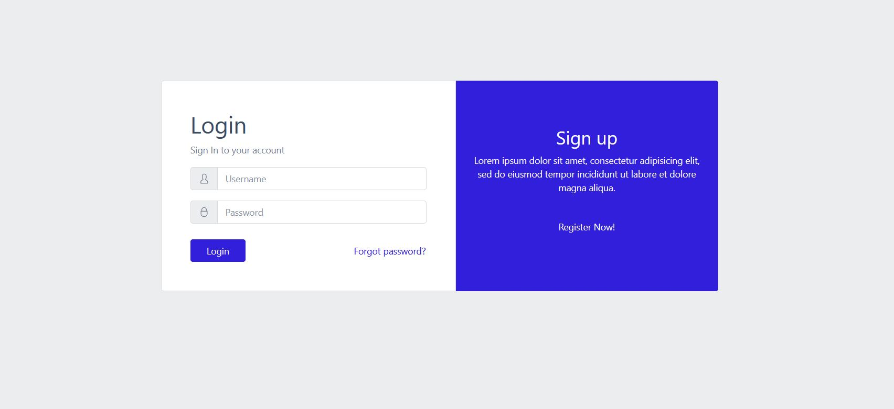

# CoreUI-LogIn-Page

<h2>Summary :</h2> 
A simple LogIn/Register page using Core UI.

Learning Curve involved :
- Understanding of ReactJS 
- Understanding of React Routers 
- Understanding of React Forms
- Understanding of bootstrap (for ReactJS) 

<h2>Screenshots for Reference</h2>

<h3> Log In page </h3>

 
<h3> Register Page </h3>

Please note that the page is not a custom build, rather it comes pre-designed with CORE UI. This is the extracted version of the page to get familiar with the library. 

